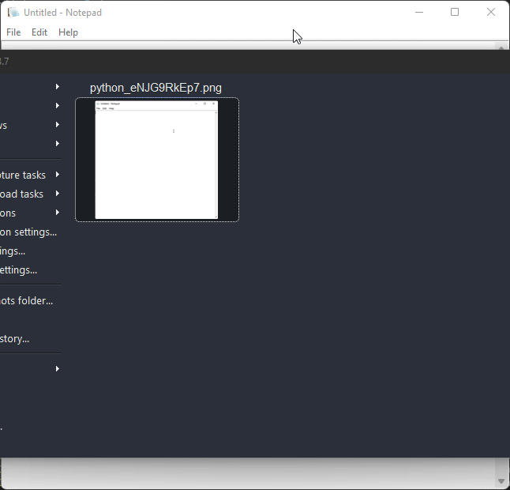

# Notepad Clone
As we know notepad has such easy ad simple UI, so one can take not very easily without any hesitation.
This notepad-clone is built using python programming language. There are a lot of libraries available in python, such that it's very helpful to built software.In this mini Project I have used Tkinter library.

To run this file: python file_path (simple as run any python file) 
### Category: Software(built using Python)

### Preview:
 